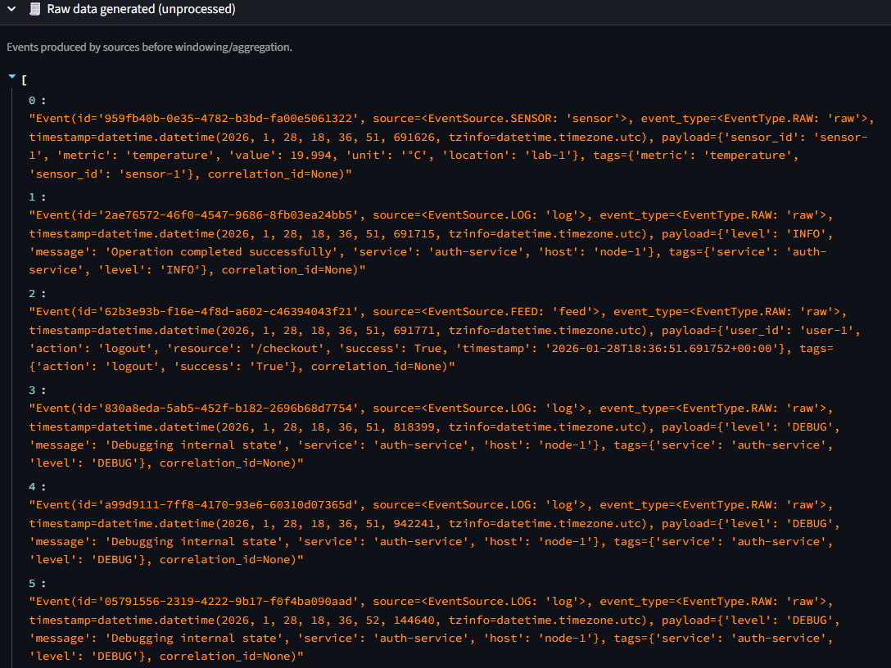
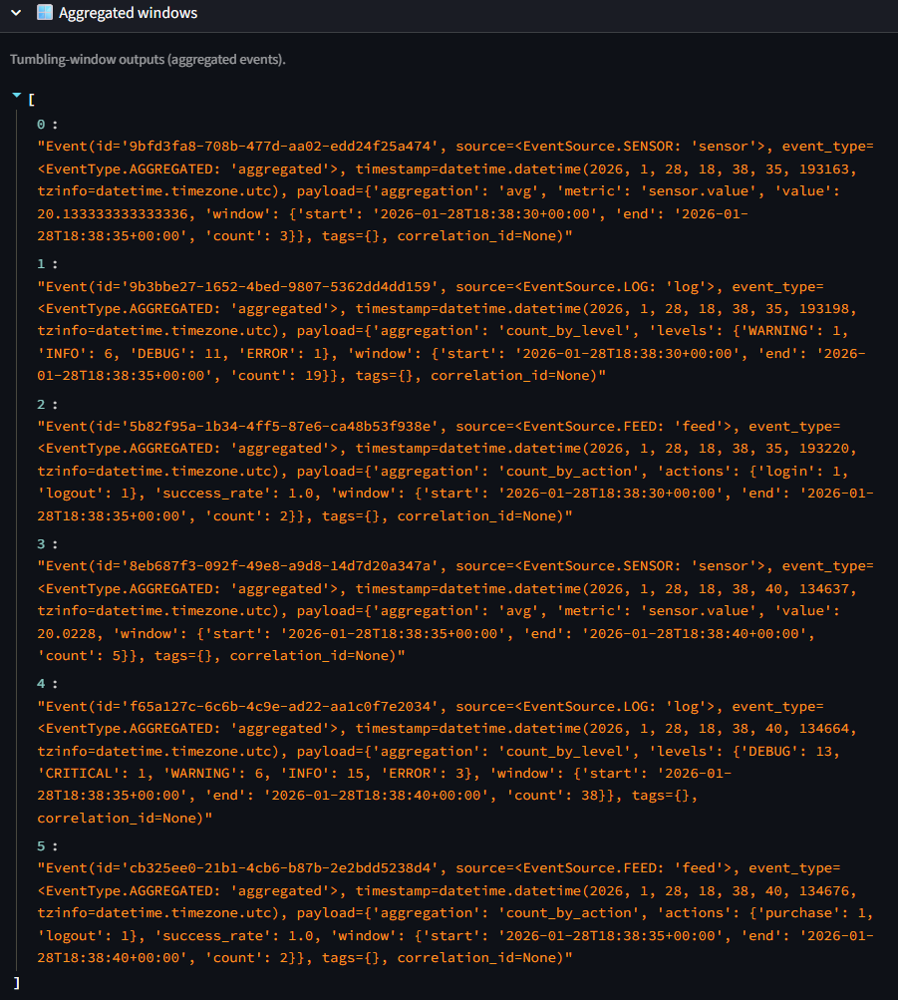
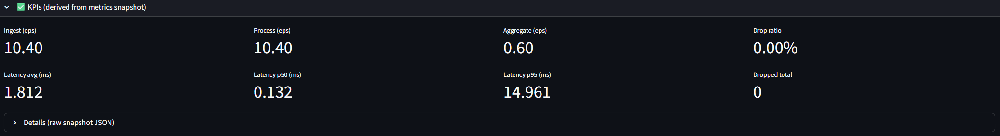
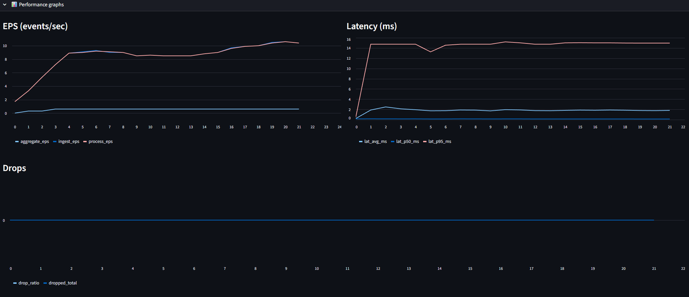
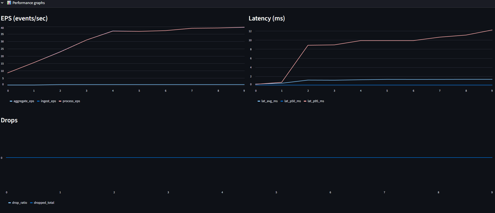

# PFN Streaming Pipeline Dashboard  
**Real-Time Functional Data Processing with Async Pipelines**

## Overview

This project implements a **real-time data processing system** based on the principles of **Non-Sequential Functional Programming (PFN)**.

It simulates multiple asynchronous data sources (logs, sensors, user activity feeds) and processes them through a **functional streaming pipeline** that performs:

- parsing
- filtering
- mapping (transformation)
- windowed aggregation (reduce)

All processing is done **without shared mutable state**, using **asyncio**, message passing, and immutable event structures.  
A **Streamlit dashboard** provides real-time observability over raw events, aggregated windows, and performance metrics.

This project corresponds to **PFN – Project Theme 5**:  
*Real-time aggregation and processing of data streams using functional pipelines and concurrency.*

---

## Functional Programming Focus (PFN)

The project demonstrates the following PFN concepts:

- **Functional pipeline composition** (`map`, `filter`, `reduce`)
- **Immutable data models** (events are never modified in-place)
- **Windowed reduction** using tumbling time windows
- **Concurrency without shared state** (asyncio tasks + queues)
- **Separation of concerns** between sources, processing, aggregation, metrics, and UI

The emphasis is on **behavior, composition, and concurrency**, not on mathematical formalism.

---

## High-Level Architecture

```
[ Sensor Source ] ┐
[ Log Source    ] ├──> EventBus ──> Functional Pipeline ──> Window Aggregation
[ Feed Source   ] ┘                                      └─> Metrics Collector
                                                               ↓
                                                        Streamlit Dashboard
```

- **Sources** generate events asynchronously
- **EventBus** routes events via queues (message passing)
- **Pipeline** applies functional transformations
- **Aggregation** groups events into time windows
- **Metrics** track throughput, latency, and drops
- **UI** visualizes everything in real time

---

## Project Structure

```
SequentialPipelineAnalysis/
├── app.py                     # Streamlit UI entrypoint
├── core/
│   ├── bus.py                 # EventBus (queues, backpressure, drops)
│   └── models.py              # Immutable event models
├── runtime/
│   ├── async_processor.py     # Functional pipeline + windowing
│   └── supervisor.py          # Lifecycle management
├── sources/
│   ├── sensor_source.py
│   ├── log_source.py
│   └── feed_source.py
├── metrics/
│   └── collector.py           # Throughput, latency, drops
├── ui/
│   ├── engine_bridge.py       # Async engine ↔ UI bridge
│   └── runner.py              # Background asyncio runner
├── tests/                     # Deterministic unit tests (pytest)
├── images/                    # Screenshots for documentation
├── requirements.txt
└── README.md
```

---

## Setup Instructions

### 1. Create a virtual environment

```bash
python -m venv .venv
```

Activate it:

**Windows (PowerShell)**
```powershell
.venv\Scripts\Activate.ps1
```

**Linux / macOS**
```bash
source .venv/bin/activate
```

---

### 2. Install dependencies

```bash
pip install -r requirements.txt
```

---

## Running the Application

Start the Streamlit dashboard:

```bash
streamlit run app.py
```

Then open your browser at:
```
http://localhost:8501 or http://localhost:8502
```

---

## Running Tests

The project includes **deterministic unit tests** for all core logic (time windowing, pipeline behavior, aggregators, event bus).

Run:

```bash
pytest
```

All tests should pass in under a second.

---

## What to Observe in the UI

The dashboard mirrors the functional pipeline stages.

### 1. Raw Data (Unprocessed)

- Events generated directly by sources
- No aggregation or windowing applied
- Demonstrates concurrent event production



---

### 2. Aggregated Windows

- Events grouped into **tumbling time windows**
- Separate aggregates per source:
  - sensor averages
  - log level counts
  - feed action statistics



---

### 3. KPIs (Derived Metrics)

- Throughput (events / second)
- Processing latency (avg, p50, p95)
- Aggregation rate
- Drop ratio (visible under stress)



---

### 4. Performance Graphs

- Time evolution of:
  - ingestion rate
  - processing rate
  - latency
  - drop ratio



---

## Stress Mode (Optional Experiment)

The system supports a **stress configuration** with:

- higher input rates
- smaller queues
- artificial processing delays

This allows observation of:

- latency growth
- throughput saturation
- backpressure vs dropping behavior



---

## Why This Fits PFN

- Functional transformations over event streams
- Windowed `reduce` as a core primitive
- Concurrency via message passing (not shared memory)
- Immutable data + composition
- Clear separation between computation and visualization